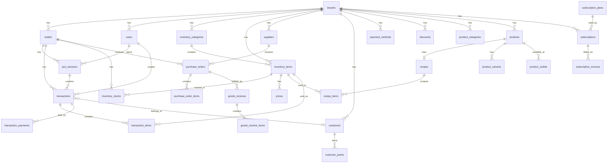

# Entity Relationship Diagram (ERD)

## Overview Sistem

Sistem ini adalah **Multi-Tenant POS (Point of Sale) SaaS** dengan fitur lengkap untuk inventory management, recipe management, dan product management.

## Arsitektur Data

Sistem terbagi dalam beberapa domain utama:

### 1. Multi-Tenancy & User Management
```
┌─────────────┐
│   tenants   │
└─────┬───────┘
      │ 1:N
      ├──────────────────┬──────────────────┬─────────────────┐
      ▼                  ▼                  ▼                 ▼
┌─────────────┐   ┌─────────────┐   ┌─────────────┐   ┌──────────────┐
│   outlets   │   │    users    │   │    roles    │   │ permissions  │
└─────────────┘   └─────────────┘   └─────────────┘   └──────────────┘
      │                  │                 │                  │
      │                  │                 └────────┬─────────┘
      │                  │                          │
      │           ┌──────┴──────┐           ┌──────────────────┐
      │           │ user_roles  │           │ role_permissions │
      │           └─────────────┘           └──────────────────┘
      │
      └─────────────────┐
                        ▼
               ┌────────────────┐
               │  user_outlets  │
               └────────────────┘
```

### 2. Inventory Management
```
┌───────────────────────┐
│  inventory_categories │ (self-referential: parent_id)
└───────────┬───────────┘
            │ 1:N
            ▼
┌───────────────────────┐        ┌─────────────┐
│   inventory_items     │◄───────│    units    │ (unit_id, purchase_unit_id)
└───────────┬───────────┘        └─────────────┘
            │
    ┌───────┼───────────────────────────┐
    │       │                           │
    │       ▼                           ▼
    │  ┌─────────────────┐    ┌─────────────────────┐
    │  │ inventory_stocks│    │   supplier_items    │
    │  │ (per outlet)    │    │ (item <-> supplier) │
    │  └─────────────────┘    └─────────────────────┘
    │
    ▼
┌─────────────────────┐
│   stock_movements   │ (audit trail semua pergerakan stok)
└─────────────────────┘

┌─────────────────────┐
│   stock_batches     │ (batch/lot tracking dengan expiry)
└─────────────────────┘
```

### 3. Purchasing & Receiving
```
┌─────────────┐
│  suppliers  │
└──────┬──────┘
       │ 1:N
       ▼
┌──────────────────────┐         ┌───────────────────────┐
│   purchase_orders    │────────►│  purchase_order_items │
└──────────┬───────────┘         └───────────────────────┘
           │ 1:N
           ▼
┌──────────────────────┐         ┌───────────────────────┐
│   goods_receives     │────────►│  goods_receive_items  │
└──────────────────────┘         └───────────────────────┘
```

### 4. Stock Operations
```
┌───────────────────────┐         ┌─────────────────────────┐
│   stock_adjustments   │────────►│  stock_adjustment_items │
└───────────────────────┘         └─────────────────────────┘

┌───────────────────────┐         ┌─────────────────────────┐
│   stock_transfers     │────────►│   stock_transfer_items  │
│ (outlet to outlet)    │         └─────────────────────────┘
└───────────────────────┘

┌───────────────────────┐
│     waste_logs        │ (logging waste/spoilage)
└───────────────────────┘
```

### 5. Recipe Management
```
┌─────────────┐         ┌────────────────┐         ┌─────────────────────┐
│   recipes   │────────►│  recipe_items  │────────►│   inventory_items   │
└─────────────┘         └────────────────┘         └─────────────────────┘
       │
       │ (dapat dilink ke product)
       ▼
┌─────────────┐
│  products   │
└─────────────┘
```

### 6. Product Management (Menu/Catalog)
```
┌───────────────────────┐
│  product_categories   │ (self-referential: parent_id)
└───────────┬───────────┘
            │ 1:N
            ▼
┌───────────────────────┐
│      products         │ (single, variant, combo)
└───────────┬───────────┘
            │
    ┌───────┴───────────────┬───────────────────────┐
    │                       │                       │
    ▼                       ▼                       ▼
┌─────────────────┐  ┌──────────────────┐   ┌─────────────────────────┐
│product_variants │  │product_outlets   │   │product_modifier_groups  │
│(ukuran, warna)  │  │(availability)    │   │(topping, addon, dll)    │
└─────────────────┘  └──────────────────┘   └─────────────────────────┘

┌───────────────────┐         ┌─────────────────────┐
│  variant_groups   │────────►│   variant_options   │
│  (Size, Color)    │         │   (S, M, L, Red)    │
└───────────────────┘         └─────────────────────┘

┌───────────────────┐         ┌─────────────────────┐
│  modifier_groups  │────────►│     modifiers       │
│  (Topping, Extra) │         │  (Cheese, Bacon)    │
└───────────────────┘         └─────────────────────┘

┌───────────────────┐         ┌─────────────────────┐
│     combos        │────────►│    combo_items      │
│  (paket/bundle)   │         │  (products in combo)│
└───────────────────┘         └─────────────────────┘
```

### 7. POS & Transactions
```
┌─────────────────┐
│   pos_sessions  │ (shift kasir)
└────────┬────────┘
         │ 1:N
         ▼
┌─────────────────┐      ┌─────────────────────┐
│  transactions   │─────►│  transaction_items  │─────► inventory_items
└────────┬────────┘      └─────────────────────┘
         │
         ├──────────────────────────┐
         ▼                          ▼
┌─────────────────────┐   ┌───────────────────────┐
│transaction_payments │   │ transaction_discounts │
└─────────────────────┘   └───────────────────────┘
         │
         ▼
┌─────────────────┐
│ payment_methods │
└─────────────────┘

┌─────────────────┐
│  held_orders    │ (order yang ditahan sementara)
└─────────────────┘

┌─────────────────────┐
│  cash_drawer_logs   │ (log cash drawer)
└─────────────────────┘
```

### 8. Customer & Loyalty
```
┌─────────────────┐         ┌─────────────────────┐
│    customers    │────────►│   customer_points   │
└─────────────────┘         └─────────────────────┘
        │
        │ dapat dilink ke transactions
        ▼
┌─────────────────┐
│  transactions   │
└─────────────────┘
```

### 9. Pricing & Discounts
```
┌─────────────────┐
│     prices      │ (harga per outlet per item)
└─────────────────┘
        │
        │ link ke inventory_items + outlets
        ▼
┌─────────────────┐    ┌─────────────┐
│ inventory_items │    │   outlets   │
└─────────────────┘    └─────────────┘

┌─────────────────┐
│    discounts    │ (promo, voucher)
└─────────────────┘
```

### 10. Subscription (SaaS Billing)
```
┌─────────────────────┐
│  subscription_plans │
└──────────┬──────────┘
           │ 1:N
           ▼
┌─────────────────────┐         ┌─────────────────────────┐
│    subscriptions    │────────►│  subscription_invoices  │
│   (tenant based)    │         └─────────────────────────┘
└─────────────────────┘
```

---

## Mengapa POS Tidak Mengambil dari Table `products`?

### Alasan Arsitektur

Berdasarkan analisis kode di `PosController.php`, halaman POS **mengambil data dari `inventory_items`** bukan `products`. Ini adalah **keputusan arsitektur yang disengaja** karena:

#### 1. **Dua Fase Development**

Sistem dibangun dengan pendekatan bertahap:

| Phase | Table | Fungsi |
|-------|-------|--------|
| Phase 1-2 | `inventory_items` | Inventory dasar, raw materials, bahan baku |
| Phase 3 | `products` | Menu items, produk jual dengan variants & modifiers |

#### 2. **Perbedaan Konsep**

```
inventory_items (CURRENT POS)          products (FUTURE POS)
─────────────────────────────          ──────────────────────
- Raw material / bahan baku            - Menu item / produk jual
- Simple item                          - Support variants (S/M/L)
- Direct stock tracking                - Support modifiers (topping)
- Cost-focused                         - Support combo/bundle
- Tanpa variants                       - Price per outlet
- Tanpa modifiers                      - Link ke recipe
```

#### 3. **Relasi Table products**

Table `products` memiliki relasi yang lebih kompleks:
- `product_variants` - varian produk (ukuran, warna)
- `product_modifier_groups` - addon/topping
- `product_outlets` - ketersediaan per outlet
- `recipe_id` - link ke resep untuk hitung HPP
- `inventory_item_id` - link ke inventory untuk simple products

#### 4. **Kondisi Saat Ini**

POS saat ini menggunakan:
```php
// PosController.php:83
$query = InventoryItem::where('tenant_id', $user->tenant_id)
    ->where('is_active', true)
    ->with(['category', 'unit']);
```

Dan pricing diambil dari table `prices`:
```php
// PosController.php:102
$prices = Price::where('outlet_id', $outletId)
    ->whereIn('inventory_item_id', $items->pluck('id'))
```

#### 5. **Rekomendasi untuk Migrasi ke Products**

Untuk menggunakan table `products` di POS, diperlukan:

1. **Update PosController** untuk query dari `products` bukan `inventory_items`
2. **Handle product variants** di cart dan checkout
3. **Handle modifiers** (topping, addon)
4. **Update pricing logic** untuk products
5. **Update transaction_items** FK ke product/variant
6. **Handle combo products**

### Diagram Flow Saat Ini vs Future

**Saat Ini:**
```
POS → InventoryItem → Price → Transaction → TransactionItem
```

**Seharusnya (Full Product Support):**
```
POS → Product/ProductVariant → ProductOutlet/Price → Transaction → TransactionItem
         ↓
    Modifiers (optional)
```

---

## Daftar Table Lengkap

| # | Table | Deskripsi |
|---|-------|-----------|
| 1 | tenants | Master tenant/company |
| 2 | users | User accounts |
| 3 | outlets | Store/branch locations |
| 4 | roles | User roles |
| 5 | permissions | System permissions |
| 6 | role_permissions | Role-permission mapping |
| 7 | user_roles | User-role mapping |
| 8 | user_outlets | User-outlet access |
| 9 | units | Unit of measure |
| 10 | suppliers | Supplier master |
| 11 | inventory_categories | Inventory categories (hierarchical) |
| 12 | inventory_items | Inventory items / raw materials |
| 13 | inventory_stocks | Stock per outlet |
| 14 | stock_batches | Batch/lot tracking |
| 15 | stock_movements | Stock movement audit |
| 16 | supplier_items | Item-supplier mapping |
| 17 | purchase_orders | Purchase orders |
| 18 | purchase_order_items | PO line items |
| 19 | goods_receives | Goods receipt |
| 20 | goods_receive_items | GR line items |
| 21 | stock_adjustments | Stock adjustments |
| 22 | stock_adjustment_items | Adjustment line items |
| 23 | stock_transfers | Inter-outlet transfers |
| 24 | stock_transfer_items | Transfer line items |
| 25 | waste_logs | Waste/spoilage log |
| 26 | recipes | Recipe master |
| 27 | recipe_items | Recipe ingredients |
| 28 | product_categories | Product categories |
| 29 | products | Products/menu items |
| 30 | variant_groups | Variant groups (Size, Color) |
| 31 | variant_options | Variant options (S, M, L) |
| 32 | product_variants | Product variant combinations |
| 33 | product_variant_groups | Product-variant mapping |
| 34 | modifier_groups | Modifier groups (Topping) |
| 35 | modifiers | Modifier options |
| 36 | product_modifier_groups | Product-modifier mapping |
| 37 | combos | Combo/bundle master |
| 38 | combo_items | Combo components |
| 39 | product_outlets | Product availability per outlet |
| 40 | customers | Customer master |
| 41 | customer_points | Points history |
| 42 | payment_methods | Payment method master |
| 43 | prices | Item prices per outlet |
| 44 | discounts | Discount/promo master |
| 45 | pos_sessions | Cashier sessions/shifts |
| 46 | transactions | Sales transactions |
| 47 | transaction_items | Transaction line items |
| 48 | transaction_payments | Payment records |
| 49 | transaction_discounts | Applied discounts |
| 50 | held_orders | Held/pending orders |
| 51 | cash_drawer_logs | Cash drawer audit |
| 52 | subscription_plans | SaaS subscription plans |
| 53 | subscriptions | Tenant subscriptions |
| 54 | subscription_invoices | Subscription invoices |

---

## ERD Diagram (Mermaid)


